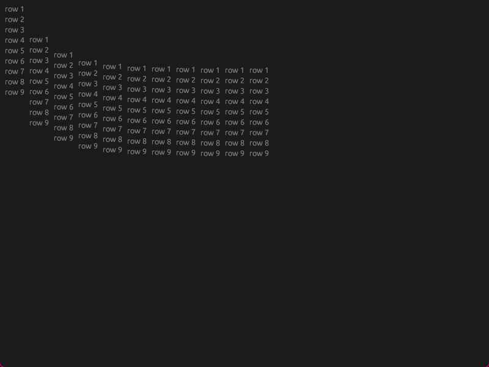

# Bug Reproduction Repository

This repository is a minimal[^1] reproduction setup for a bug with [egui](https://github.com/emilk/egui).

[^1]: As minimal as I could reasonably make it to run on its own.
  It runs `egui` through `eframe`, which adds a lot of dependencies and hidden mechanisms, but makes the code part succint, and the actual reproduction steps simple.

## Bug description
Corresponding Egui Issue: emilk/egui#5535

### Situation:
We add a series of vertical layouts in a horizontal layout, each allocated to a certain width.

Allocation, according to the [egui documentation](https://docs.rs/egui/0.30.0/egui/struct.Ui.html#method.allocate_ui), expands and shrinks if needed. We understand that to mean that the given size is inherently only useful if the child ui has widgets that try to take up the "available space", which we do not have here. Therefore, we allocate an arbitrary size.

### Expected behaviour:
The lists are aligned horizontally, as they are all the same size.

### Actual behaviour:
The lists are vertically offset according to what appears to be some logarithmic function.

## Reproduction steps:
1. Clone this repository
2. Run the executable
